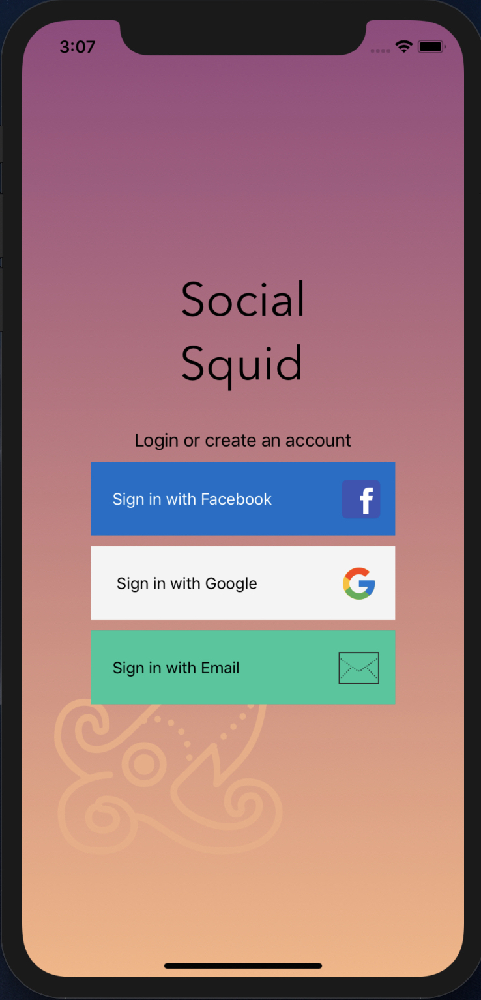

<h1>About this repository</h1>

I am creating a simple login screen where the user will be able to sign in using Facebook, Google, or Email. With this practice, I am learning more about auto layout and how to build user interfaces with Xcode and Interface Builder. Auto Layout is what Xcode uses to size and position elements on your user interface.

